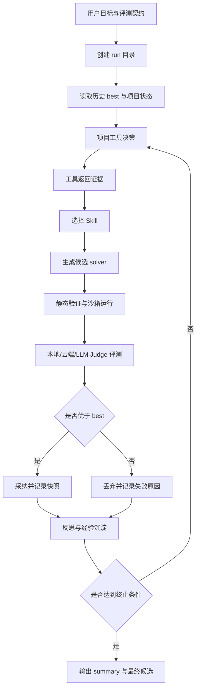

# LoopForge 产品说明文档

> 版本：v0.1  
> 定位：面向算法竞赛、评测驱动开发和自动化研发场景的 AI 自迭代工作台
> demo:http://81.71.7.21:5173/

## 1. 产品定位与价值

### 1.1 产品一句话

LoopForge 是一个让 AI Agent 围绕明确目标、评测契约和项目工具持续迭代代码方案的可视化工作台。它把“调研、决策、改代码、评测、反思、沉淀经验”组织成一个可观察、可约束、可复盘的 agent loop。

### 1.2 需求分析

在算法竞赛、优化问题、评测型工程任务中，开发者常见痛点是：

- 迭代高度依赖人工经验：需要反复阅读题意、分析失败样例、修改 solver、运行评测、总结经验。
- LLM 能生成代码，但缺少闭环：模型一次性生成方案后，很难稳定地根据评测结果继续修正。
- 工具调用不可见：Agent 为什么读某个文件、为什么查资料、为什么选择某个方向，常以日志形式散落，不利于人理解。
- 评测接口不统一：不同项目有不同评测集、评测脚本、指标方向、是否有标签、是否需要 LLM-as-judge。
- 安全边界不清晰：如果允许 Agent 执行命令或写文件，需要限制在项目目录和明确的工具集合内。
- 经验难复用：一次成功或失败的策略如果只留在日志里，后续 Agent 很难稳定继承。

LoopForge 的目标是把这些动作产品化：

- 用户提供目标、边界、评测材料。
- 后台生成或适配统一评测契约。
- Agent 在受限工具集内自主收集证据、改进代码、执行评测。
- 前端以“决策链”而不是纯日志展示每轮迭代。
- 成功经验可以沉淀为 Skill，下一轮自动预加载描述并按需加载正文。

### 1.3 核心价值

对算法竞赛用户：

- 缩短从思路到验证的周期。
- 让模型围绕真实指标持续试错，而不是只生成一次答案。
- 保留完整迭代过程，便于复盘为什么某个 solver 变好或变差。

对工程团队：

- 可迁移到任意“有目标、有评测、有待优化代码”的场景。
- 将评测驱动开发从人工串联变成自动闭环。
- 为后续多项目、多租户、云端评测平台打基础。

对 AI 产品本身：

- 不只是聊天助手，而是一个有工具、有记忆、有评测、有经验沉淀的研发执行系统。
- 将 Agent 的中间决策可视化，提升人对自动化过程的信任和干预能力。

### 1.4 设计思路

LoopForge 的设计原则是“简单 loop + 强约束 + 全链路可视化”。

1. 简单 loop

   当前架构不使用复杂图编排，而是采用顺序 agent loop：

   ```text
   读取目标与上下文
     -> 选择工具 / 调研 / 读取项目证据
     -> 加载 Skill
     -> 生成候选代码
     -> 验证接口和依赖
     -> 本地评测
     -> 采纳或丢弃
     -> 反思并写入日志 / 经验 / Skill
   ```

   这样更容易调试、展示和安全控制。

2. 离线与在线分离

   对算法竞赛类任务，线上提交代码不能调用 LLM。LoopForge 只在离线阶段使用 LLM 生成和评估候选方案，最终交付物仍是纯代码，例如 `solver.py`。

3. 评测契约先行

   用户可以上传评估集、粘贴评测脚本、描述指标和好坏倾向。系统会把这些输入整理为统一的 Evaluation Contract，避免每个项目从零约定接口。

4. 工具受限开放

   Agent 可以读取项目文件、写分析脚本、运行 Python、读取论文、联网调研，但工具都显式声明用途和安全边界。项目工具默认限制在项目目录内。

5. 经验内化

   成功或失败经验不只写日志，还可以沉淀成 Markdown Skill。Loop 启动时预加载 skill 描述，运行时按上下文选择正文，控制 token 成本。

6. 面向人展示决策链

   前端不把过程展示成终端日志，而是拆成“决策-动作”节点：理由、工具名、参数、目的、返回摘要、代码变化、评测结果和反思。

## 2. AI 技术栈选型

### 2.1 总体技术栈

| 模块 | 技术选型 | 作用 |
| --- | --- | --- |
| 前端 | React + Vite + TypeScript | 快速构建可视化工作台 |
| 动效与流程图 | Framer Motion + React Flow | 动态展示迭代流程和回合节点 |
| 代码展示 | Monaco Diff Editor | 展示 `solver.py` 每轮代码变化 |
| 后端 | Node.js + Express + WebSocket | 启动 agent、上传评测集、订阅事件流 |
| Agent Loop | Python | 执行 LLM 生成、工具调用、验证、评测 |
| LLM 接入 | OpenAI-compatible API | 支持真实模型调用和 dry-run 模式 |
| 文件与数据 | JSONL / Markdown / Python 文件 | 低成本保存完整轨迹与经验 |
| 安全鉴权 | 环境变量密码 + Bearer token | 公网访问的基础防护 |

### 2.2 AI 能力详解

#### 2.2.1 LLM as Designer：生成候选代码

LLM 根据目标、已有 best solver、评测反馈、项目证据和选中的 Skill，生成新的候选方案。生成目标不是自由发挥，而是围绕受控接口，例如：

```python
def solve(input_text: str) -> list:
    ...
```

对竞赛场景，生成代码必须保持纯 Python 标准库，不能引入线上不可用依赖。

#### 2.2.2 LLM as Optimizer：选择探索方向

Agent 每轮需要判断：

- 当前失败是覆盖不足、成本过高、运行超时，还是格式错误。
- 是否需要调研。
- 是否需要读取项目文件或写分析脚本。
- 是否应该做小幅局部改动，还是尝试新策略。

这些决策由 LLM 结合历史经验和工具返回结果完成。

#### 2.2.3 LLM as Extractor：提炼经验与 Skill

当某个方向连续失败或成功时，Agent 可以把经验提炼为 Skill，例如：

- 什么场景适用。
- 哪些指标必须保护。
- 哪些反模式要避免。
- 下一轮生成代码时应遵守什么约束。

Skill 是 Markdown，不是可执行插件，因此风险更低，也更适合被人审阅。

#### 2.2.4 LLM as Judge：无评测集时的语义评估兜底

如果用户没有评估集，也没有可执行评测脚本，系统可以创建 LLM-as-judge 草案。用户需要提供 rubric 或目标描述，系统再将候选输出交给 LLM 做语义判断。

该能力适合：

- 文本生成类任务。
- 规则难以完全编码的任务。
- 早期概念验证。

但对算法竞赛类任务，仍优先使用确定性本地评测或官方评测。

#### 2.2.5 Tool-Using Agent：项目工具调用

当前工具集包括：

- `list_files`：列出项目文件。
- `read_file`：读取项目内文件。
- `analyze_online_results`：分析线上结果。
- `write_analysis_script`：在 run 目录写入分析脚本。
- `run_python`：运行项目内 Python 脚本。
- `read_local_papers`：读取本地论文材料。
- `arxiv_search`：检索外部论文。
- `web_fetch_url`：读取指定网页。
- `generate_solver`：生成候选 solver。
- `validate_solver`：验证接口和依赖。
- `evaluate_local`：本地评测。
- `select_skill`：选择 Skill。
- `write_skill`：写入新 Skill。

每个工具都有目的、参数和安全边界，前端会把工具调用作为决策链节点展示。

### 2.3 为什么不用复杂 Agent 图

当前产品阶段选择单一 loop，而不是多节点复杂图，原因是：

- 用户首先需要可跑通的闭环，而不是复杂编排能力。
- 算法迭代的核心瓶颈是评测反馈和经验内化，不是节点数量。
- 顺序 loop 更容易可视化，每轮都有自然的开始、动作、评测、反思。
- 安全控制更直接，工具权限和写文件边界更容易约束。

后续可以在 loop 内部增加更复杂的策略选择，但不必先把整体架构复杂化。

## 3. 具体功能流程架构

### 3.1 用户启动流程

1. 用户进入 LoopForge 页面。
2. 公网模式下输入访问密码登录。
3. 用户填写目标，例如“降低平均惩罚分数，保持完成率 100%”。
4. 用户配置终止条件：
   - 最大轮数。
   - 最大运行时间。
   - 最大 token。
   - 单次评测超时。
5. 用户选择是否开启：
   - 真实 LLM。
   - 首轮调研。
   - 项目工具。
   - 写入 Skill。
   - 覆盖 `solver.py`。
6. 用户上传评估集或粘贴评测脚本。
7. 系统生成 Evaluation Contract 草案。
8. 用户验证并保存契约。
9. 用户点击启动。

### 3.2 Agent 自迭代流程



### 3.3 数据与事件架构

每次运行都会创建：

```text
runs/<run_id>/
  events.jsonl
  iterations.jsonl
  research.md
  round_*.py
  summary.json
  evaluation_contract.json
  tool_scripts/
```

关键文件说明：

- `events.jsonl`：前端可视化主数据源，记录所有生命周期事件。
- `iterations.jsonl`：每轮策略、指标和采纳状态。
- `research.md`：调研结果摘要。
- `round_*.py`：候选 solver 代码。
- `summary.json`：最终结果、best 指标、运行预算消耗。
- `evaluation_contract.json`：本次运行使用的评测契约。

### 3.4 生命周期 Hook

LoopForge 支持 Hook 机制，便于扩展日志、指标和可视化：

```python
def my_hook(event_type: str, payload: dict, context: HookContext) -> None:
    ...
```

核心事件包括：

- `run_start`
- `round_start`
- `project_tool_decision`
- `research_decision`
- `tool_call`
- `skill_selection`
- `generation`
- `validation`
- `evaluation`
- `accepted`
- `skill_write`
- `round_end`
- `run_end`

Hook 的设计价值是把核心 loop 和外围能力解耦。后续如果要接入 BI 看板、告警、数据仓库或实验追踪系统，不需要改动主流程。

### 3.5 Skill 动态加载机制

Skill 是 Agent 的可复用经验模块，格式为 Markdown frontmatter + 正文：

```markdown
---
id: project_evidence_loop
name: 项目证据循环
description: 先读项目状态和历史评测，再写小脚本验证假设。
scope: generic
triggers: evidence, replay, evaluation
---

# 适用场景

# 操作流程

# 反模式
```

当前分为三类：

- `generic`：通用能力，可迁移到其他项目。
- `project`：当前赛题或当前项目专用。
- `system`：自扩展、能力管理类。

运行时只预加载描述，不直接塞入所有正文。模型根据目标、上下文和失败原因选择少量 Skill 加载，以控制上下文长度。

### 3.6 安全架构

公网部署已加入基础鉴权：

- 使用 `web/server.config.json` 设置账号、密码和会话密钥。
- 登录后前端保存 Bearer token。
- API 请求必须带 token。
- WebSocket 事件订阅也必须带 token。
- 未开启 `auth.enabled` 时保留本地开发模式，但不建议公网开放。

项目工具安全边界：

- 文件读写限制在项目目录内。
- 分析脚本写入 `runs/<run_id>/tool_scripts/`。
- 不开放任意 shell 命令入口。
- `solver.py` 默认不覆盖，只有显式开启覆盖选项才会导出 best。

## 4. 原型说明与演示

### 4.1 原型名称

LoopForge

名称含义：

- `Loop`：代表持续迭代的 Agent Loop。
- `Forge`：代表把策略、代码和经验不断锻造成更好的方案。

### 4.2 Logo 说明

Logo 文件：

```text
web/public/loopforge-logo.svg
```

视觉含义：

- 双向环形箭头表示自迭代闭环。
- 中心六边形表示工程化、结构化和可控边界。
- 中央十字表示生成、修复和能力扩展。
- 青绿色代表探索和工具调用。
- 铜橙色代表锻造、实验和策略更新。

### 4.3 演示入口

> DEMO地址:http://81.71.7.21:5173/

本地启动：

```bash
cd web
npm install
npm run dev
```

访问：

```text
http://127.0.0.1:5173
```

公网启动：

```bash
cd web
cp server.config.example.json server.config.json
vim server.config.json
npm ci
npm run dev:public
```

只需要开放：

```text
5173/tcp
```

### 4.4 演示路径

推荐演示流程：

1. 打开页面，展示 LoopForge 登录页和 Logo。
2. 输入访问密码进入主界面。
3. 展示启动区：
   - Goal。
   - 评测契约。
   - 上传评估集。
   - 终止参数。
   - 真实 LLM / 项目工具 / 写入 Skill。
4. 展示当前可用工具列表，说明工具不是黑盒。
5. 生成 Evaluation Contract 草案。
6. 启动一次 dry-run 或 live run。
7. 展示动态决策链：
   - 本轮目标。
   - 选择了什么工具。
   - 为什么调用。
   - 参数是什么。
   - 返回了什么证据。
   - 加载了什么 Skill。
   - 改了什么代码。
   - 评测结果如何。
   - 下一轮经验是什么。
8. 展示右侧 Monaco Diff Editor，对比 `solver.py` 每轮变化。
9. 展示 run 目录中的 `events.jsonl` 和 `summary.json`，说明全链路可追踪。

### 4.5 当前原型边界

当前版本已经具备：

- Web 启动 agent。
- 登录鉴权。
- 上传评估集。
- 生成评测契约草案。
- 展示工具与 Skill。
- 动态展示迭代流程。
- 展示代码变化。
- 项目内受限工具调用。
- Skill 动态加载和可选写入。

当前仍属于原型阶段的能力：

- 云端评测适配仍需进一步工程化。
- LLM-as-judge 需要更严格的 rubric、抽样和一致性校验。
- 多用户隔离、队列调度、任务配额尚未完整实现。
- 生产部署还需要 HTTPS、反向代理、日志留存和权限分级。

## 5. 落地规划

### 5.1 第一阶段：竞赛与单项目 MVP

目标：让单个项目可以稳定完成 AI 自迭代。

重点能力：

- 单项目 Web 控制台。
- 访问密码鉴权。
- 评测契约生成。
- 本地评测闭环。
- 项目工具受限调用。
- 全链路事件日志。
- Skill 手动选择和自动选择。

适用用户：

- 算法竞赛选手。
- 需要自动调参或自动改策略的个人开发者。
- 有明确评测脚本的研发团队。

### 5.2 第二阶段：通用评测平台化

目标：支持更多任务类型和评测输入。

重点能力：

- 上传多格式评估集：txt、md、json、csv、tsv、Excel、docx。
- 自动分析评测结构。
- 适配用户不规范评测脚本。
- 生成云端安全评测 adapter。
- 支持 LLM-as-judge。
- 支持多指标和指标方向配置。
- 支持候选方案版本管理。

关键产品能力：

- 用户不需要懂接口规范，也能把任务交给系统。
- 系统把自然语言目标和杂乱评测材料转为结构化契约。
- 每个 run 都能追溯使用了什么评测规则。

### 5.3 第三阶段：云端执行与团队协作

目标：从本地工具升级为云端 Agent Lab。

重点能力：

- 用户空间和项目空间隔离。
- 队列化执行 run。
- 容器沙箱运行候选代码。
- 每个项目独立依赖环境。
- 团队共享 run、Skill 和经验库。
- 权限分级：查看、启动、停止、覆盖提交物。
- 历史实验对比和可视化报表。

这一阶段需要补齐：

- HTTPS 和正式登录系统。
- 资源配额。
- 容器安全。
- 审计日志。
- 任务失败恢复。

### 5.4 第四阶段：Agent 自扩展能力

目标：让 Agent 不只改 solver，也能改进自己的工作方式。

能力方向：

- 自动生成新的 Skill。
- 自动发现缺失工具，并提出工具规格。
- 自动写分析脚本验证假设。
- 自动总结长期经验，形成项目知识库。
- 自动推荐下一轮实验方向。

需要注意的是，自扩展必须分层：

- Skill 可以自动生成，但建议人工审核。
- 工具规格可以自动提出，但可执行工具应由开发者确认。
- Agent 架构代码的修改应进入更严格的 review 流程。

### 5.5 商业价值

LoopForge 的商业价值来自三类场景。

#### 5.5.1 AI 竞赛与算法研发

用户愿意为更快的实验速度、更好的榜单成绩和更低的人工迭代成本付费。

可提供：

- 个人版：本地/云端轻量运行。
- 专业版：更多运行时长、更大评测集、更强模型。
- 团队版：共享实验、权限管理、评测队列。

#### 5.5.2 企业内部评测驱动开发

很多企业任务可以被表达为“给定目标和评测，持续改进代码或 prompt”：

- 推荐策略优化。
- 数据清洗规则优化。
- Prompt 优化。
- LLM 应用评测。
- 自动修复规则和脚本。

LoopForge 可以作为内部 AI 研发平台的一部分，降低工程师重复试错成本。

#### 5.5.3 AI Agent 可观测平台

随着 Agent 使用增多，企业会关心：

- Agent 为什么这么做。
- 调用了哪些工具。
- 返回了什么结果。
- 代码改了哪里。
- 是否遵守安全边界。
- 哪些经验被沉淀。

LoopForge 的可视化决策链和事件日志可以扩展为 Agent Observability 产品。

### 5.6 展望

LoopForge 的长期方向不是只服务某一道算法题，而是成为“评测驱动的 AI 自迭代系统”。

未来理想形态：

- 用户用自然语言描述目标。
- 系统自动理解输入、输出、评测和约束。
- Agent 自主组织调研、实验和代码修改。
- 每个动作都有理由、证据和结果。
- 成功经验自动进入 Skill 和知识库。
- 人类从逐行试错转向定义目标、审核方向和决策上线。

最终，LoopForge 希望把 AI 从“会回答问题的助手”推进到“能围绕指标持续改进系统的研发伙伴”。
